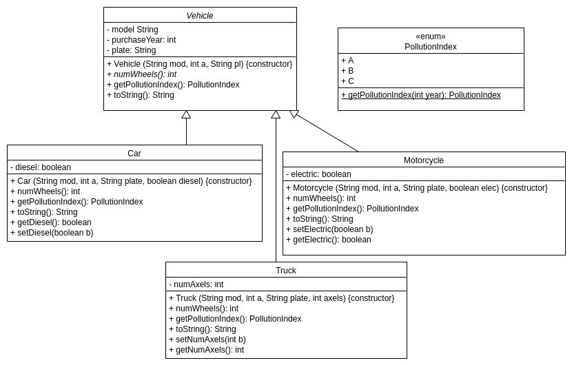

---
title:
- Practice 2. ADSOF. Part 1 diagram.
author:
- Pablo Cuesta and Diego Cid
---

Now the class *`Vehicle`* needs to have another private attribute: `plate:String`.

We have added two subclasses to the abstract class *`Vehicle`*: `Motorcycle` and `Truck`. In each of them, the methods `numWheels()`, `getPollutionIndex()` and `toString()` have to be overriden. `Motorcycle` has also the boolean attribute that indicates whether it is electric, and `Truck` has the attribute indicating the number of axles that it has.

In the initial diagram, there were costructors, getters and setters (of the atrribute `Car.diesel`); so we have added the new constructors, getters and setters to our diagram, although it is normally not necessary.
