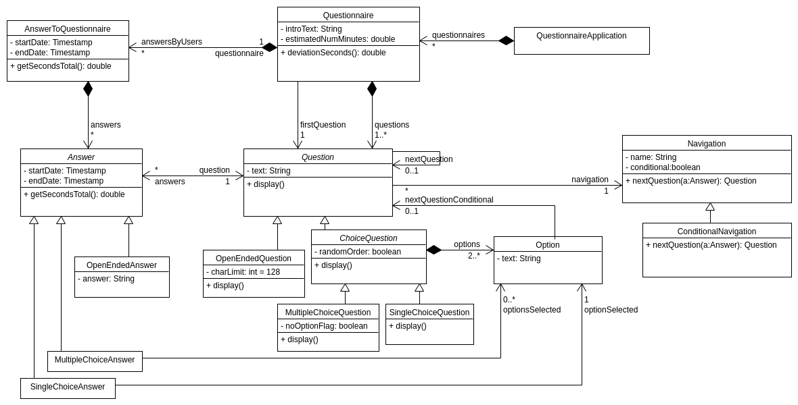
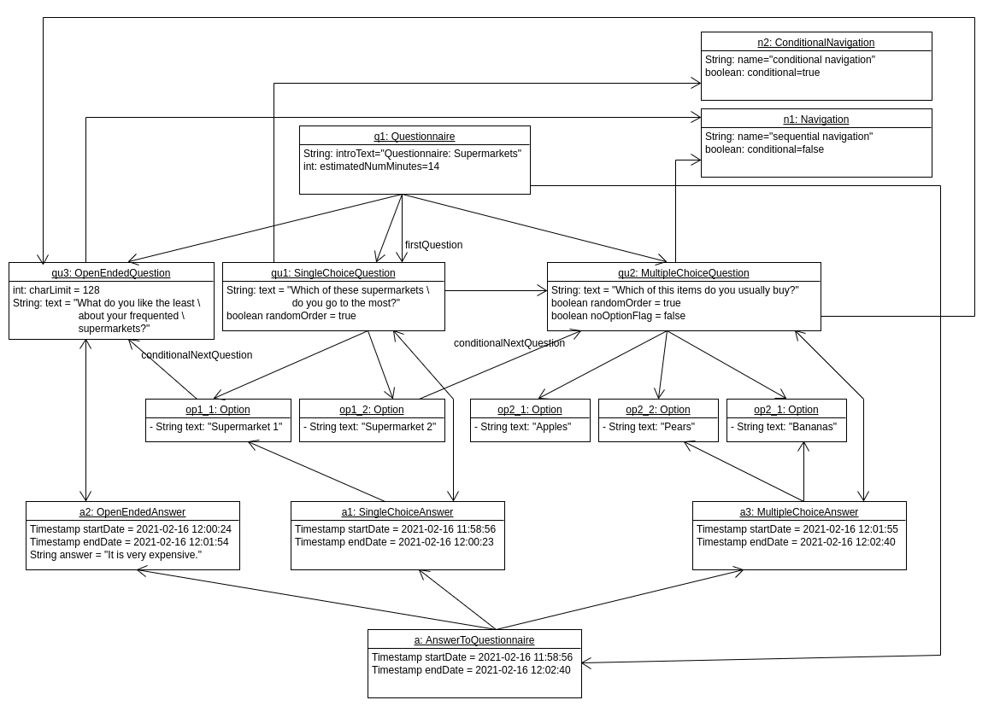

---
title:
- Practice 2. ADSOF. Part 2 diagrams.
author:
- Pablo Cuesta and Diego Cid
geometry:
- margin=2.5cm
---

# Parts 2a) and 2b)

We have designed a model in which a Questionnaire contains a set of questions (in an array, so there is one designated as the first), and also stores the set of answers submitted by each (anonymous) user. `AnswerToQuestionnaire` contains the answer submitted by each anonymous user.

We have separated questions into two main types: open ended and choice questions. Choice questions contain a set of options, those that will be displayed for the users to select. And choice questions can be of type single or multiple choice. For each type of question there is a type of answer, and all answers contain a pointer to the question they are answering, and also start and end date. Each subclass of Question has a different `display()` method, because each type will be displayed differently.

Every Question has a corresponding Navigation (`Question.navigation`). If it is not conditional (`Navigation.conditional==false`), then the method `Navigation.nextQuestion()` always returns the default `nextQuestion` of the Question object. If it is of type ConditionalNavigation (`Question.navigation`), then the method `Navigation.nextQuestion()` will be overriden in the subclass ConditionalNavigation to check the options of the answer, and will return the next question that corresponds to the option selected in the answer (`Option.nextQuestionConditional`).

# Part 2c)

{width=550}

Here is an example of an object diagram, which has two types of Navigation: a ConditionalNavigation and a (simple) Navigation.

There are three different questions, one of each type, and the answer of a user, with the three individual answers to the questions, named in order of appeareance: `a1`, `a2` and `a3`. When the user selects the option `op1_1` (of the first question, which has a conditional navigation), the next question is determined by the selected option (in this case: `op1_1.conditionalNextQuestion`). The rest of the questions, however, have no conditional navigation, so the next question is determined by the sequential order.
