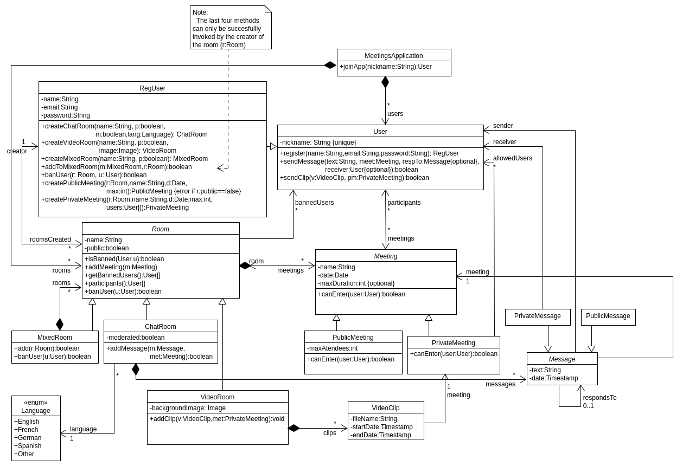

---
title:
- Practice 2. ADSOF. Part 3 diagram.
author:
- Pablo Cuesta and Diego Cid
---

# Part 3a)

The Meetings App has users and rooms. The rooms contain the meetings and can be of three types: video room, chat room or mixed room. Rooms have a boolean attribute that indicates if they are public. And meetings can be of two types: private or public.

Registered users have the same behaviour as regular users, but can also create rooms and meetings inside the rooms they have created, and also ban users from entering their rooms.

Messages are stored in a container inside the Chat Room they belong, and video clips are stored inside the Video Room in which they have been recorded.

\newpage

# Part 3b)

## 3b1)

        public abstract class Meeting{
                //attributes and methods...        
                public boolean canEnter(User u){
                        if(this.room.isBanned(u)){
                            return false;
                        }
                        return true;
                }
                //...
        }

---

        public class PrivateMeeting extends Meeting{
                //attributes and methods...        
                @Override public boolean canEnter(User u){
                        if(!super.canEnter(u)){
                                return false;
                        }
                        for(User k: this.allowedUsers){
                                if(k==u){
                                        return true;
                                }
                        }
                        return false;
                }
                //...
        }

---

        public class PublicMeeting extends Meeting{
                //attributes and methods...        
                @Override public boolean canEnter(User u){
                        if(!super.canEnter(u)){
                                return false;
                        }
                        if(this.participants.length+1 <= this.maxAtendees){
                                return true;
                        }
                        return false;
                }
                //...
        }

\newpage

## 3b2)

        public abstract class Room{
                //attributes and methods...        
                public User[] getBannedUsers(){
                        return this.bannedUsers;
                }
                public ArrayList<User> participants(){
		            ArrayList<User> part=new ArrayList<User>();
                    for (Meeting m:this.meetings){
                        for(User a:m.getParticipants()){
                            part.add(a);
                        }
                    }
                    return part;
                }
                //...
        }
        
> *Note: it is necessary for the method `Room.banUser(User u)` to be overriden inside the subclass MixedRoom, because the user has to be banned across all subrooms of that mixed room.*

