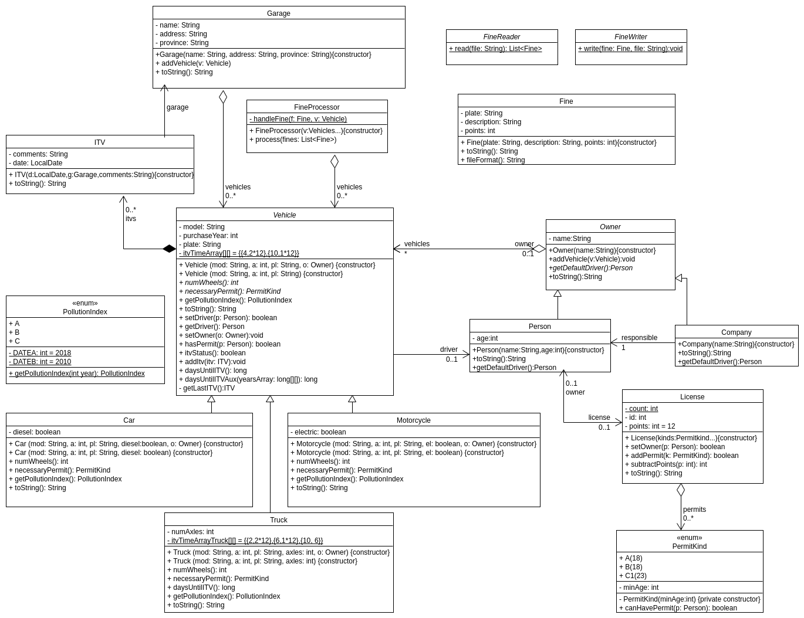

---
title:
- Practice 3. ADSOF.
author:
- Pablo Cuesta and Diego Cid
geometry:
- margin=2.5cm
---

# Class diagram



# Section 1. Drivers and vehicle owners.

In this section we have created three classes: Owner (abstract), and Company and Person (subclasses of Owner).

Also, now vehicles have a driver (of type Person) and an owner (owner can be set in the constructor optionally). If the vehicle has no driver, the owner (or responsible of the company) is assigned as driver (when the method `getDriver()` is invoked).

The tester outputs the expected messages.

# Section 2. Reading fines from text files.

For this section, we have made the proposed abstract class (FineReader), that has the method `read`, to read a list of fines from a file. We have to take into account the possibility of an `IOException`, and handle it.

# Section 3. Driving licenses.

For this we have created the License class, as well as the enumeration PermitKind (where each permit kind has an age associated with it: the minimum age to have it). The license has a bunch of permits (in a set, because it makes no sense to have repetitions).

We have created new tests to test all of the functionalities of the licenses.

It is not mentioned, but we have assumed that, of course, a license can only be assigned to a single person (if we try to assign a license to a dirver, but the license already belongs to another driver, there will be an error).
This part is tested in the test: `testerLicenseForTwoDrivers()`.


Also, when a new permit is assigned to a license, we check whether its owner has the required age for the permit, there will also be an error if the owner cannot have this new permit.
This is tested in the test:  `testTryAddLicenseRejected()`.


# Section 4. Fine processing.

For this section we have implemented the FineProcessor class, which handles the processing of fines. In our implementation, there is an auxiliary method: `private static void handleFine(Fine f, Vehicle v)`, which is where the messages of the fine are handled: depending on whether the vehicle has a driver, if the license of the driver is suspended, etc.

# Section 5. Expanding the original design.

Here we extend the design to include ITV inspections, and test its functionality with the TesterITV class.

We have to change the handling of fines in the FineProcessor, so as to handle the ITV expiration infractions and write them into a file, as requested.
This functionality is checked in the tester class of the previous section: TesterFines. And, in order to write (append) the fines information into a file, we have created an abstract class: FineWriter, which has a method *write*, that writes a given Fine object at the end of a given file.

Garages keep track of all of the vehicles that have passed the ITV there and, as we have designed it, this list of vehicles is kept in an attribute of type `List<Vehicle>` (instead of `Set<Vehicle>`, which would be the other possibility): this way if a vehicle passes the ITV in a garage more than once, it is recorded.

For this section, we have added in Vehicle two methods: 

 * `public boolean itvStatus()`: returns true if and only if the ITV is not expired.

 * `public long daysUntilITV()`: returns the number of days left until next ITV has to be passed (it is negative if the ITV is expired). 

For the dates of inspections we have used the class `java.time.LocalDate`, which contains a date with year, month and day. This class was more convinient than others (like `java.util.Date` or `java.util.Calendar`) because it does not also contain a time (hours, minutes, seconds, etc.), which in this case was not needed. To calculate differences in time we use the method `compareTo` from the LocalDate class, which returns the difference in days between two LocalDate objects. As Vehicle objects only keep track of the purchase year (and not purchase date) we have established that, by default, the purchase date is the first day (January, 1st) of the purchase year, in order to calculate the time remaining until the first inspection of the Vehicle.

\pagebreak

## `daysUntilITV()` problem and our solution.

The biggest problem in this section was the implementation of the method `daysUntilITV` (in Vehicle). 

In order not to repeat code, and make the disign as flexible as possible, the implementation of `daysUntilITV` in Vehicle is just a wrapper of another method: `public long daysUntilITVAux(long[][] timeArray)`, defined in Vehicle. This is the method where the time (in days) until the next ITV is calculated, using the array `timeArray`, which has the form: 
$$\{\{a_1,b_1\},\{a_2,b_2\},\{a_3,b_3\}, ..., \{a_n,b_n\}\}$$

where $a_1 < a_2 < a_3 < ... < a_n$. 

And the meaning of the numbers is: if the age (in years) of the vehicle is lower than $a_1$, it has to pass no inspection; if the age (in years) of the vehicle is between $a_1$ and $a_2$, then it has to pass the ITV every $b_1$ months; if the age (in years) of the vehicle is between $a_2$ and $a_3$, then it has to pass the ITV every $b_2$ months; if the age (in years) of the vehicle is between $a_3$ and $a_4$, then it has to pass the ITV every $b_3$ months; ...; if the age (in years) is higher than $a_n$, it has to pass the ITV every $b_n$ months.

For example, the default for Vehicle is: $\{\{4,2\times 12\},\{10,1\times 12\}\}$, which we have defined as a `static final` attribute of the class. 

This way, if a subclass is created that has a different year periodicity for the ITVs, the only modification to make is to define a `static final` attribute of type `long[][]` with this form and override `daysUntilITV()` just invoking `daysUntilITVAux` with this attribute. This is exactly what we have done in Truck:

```java
private static final long[][] itvTimeArrayTruck = new long[][]{{2, 2*12}, {6, 1*12}, {10, 6}}; 

@Override
public long daysUntilITV() {
	return daysUntilITVAux(itvTimeArrayTruck);
}
```

As we can see, this means that this design, although a little bit confusing (because of the strange array), can be used to very easily extend more types (subclasses) of vehicles with other periodicities for the inspections. And the code of the method that calculates the days until the next ITV is defined only once (in `daysUntilITVAux`), so we avoid code repetition.