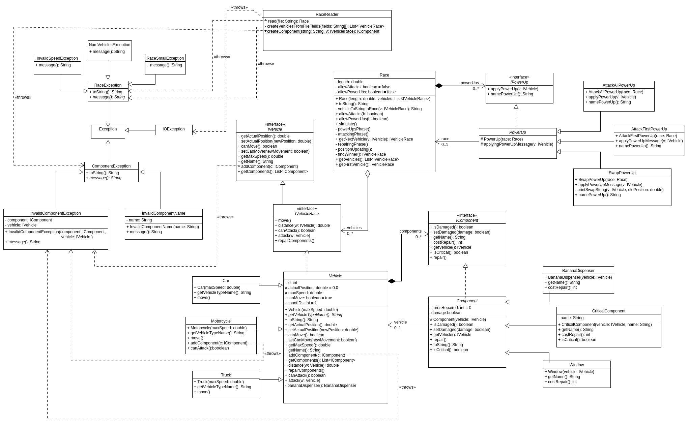

---
title:
- Practice 4. ADSOF.
author:
- Pablo Cuesta and Diego Cid
geometry:
- margin=2.5cm
header-includes: |
    \usepackage[T1]{fontenc}
    \usepackage{mathpazo}
---

# Class diagram



# Part 1: Creating vehicles for the race from a text file 

For this part, we have designed a class: RaceReader, which uses some private methods to create the race from a file. It was not specified whether the file always had 4 lines, so our implementation is very general. For each line read (apart from the first, which is always the length), a list of vehicles of the same type is created with the same specifications.

We have defined some subclasses of RaceException that can be thrown in case of the file being incorrect.

For the vehicles, we have an abstract class, with the more generic methods: *Vehicle*, and the three subclasses: Truck, Motorcycle and Car. 

# Part 2: Basic simulation of the race 

For this part, we had to implement the method `move` for each type of vehicle, and the interface IVehicle (which we could not modify), did not have it. For this reason, we have created another interface: IVehicleRace, which extends IVehicle, and has the necessary methods a vehicle that takes part in the race has to implement. So from now on, the class Race has as an attribute a list of IVehicleRace, instead of IVehicle.

For move, each vehicle has a different method, and we use the method `Math.random()` in order to simulate the probabilities.

## Answer to the question:

With the car having a maximum speed of $10$, it always wins (with the rest of vehicles as in the example). But if we put a speed higher than $9$, the car wins most of the time, although sometimes, the motorcycle wins.


# Part 3: Attacking the opponents

For this part, we have to add to the vehicles, a list of components. The method `addComponent` is overriden in Motorcycle to make sure that we do not add the components that the motorcycle can not have.

We also have to add to the interface IVehicleRace, the methods to repair all components, to attack another vehicle, and another one to know wheter a vehicle can attack in an attack turn.

# Part 4: Adding special abilities or power ups

The power up we have added is AttackFirst. The vehicle that has it attacks the first with a probability of 50%. If the vehicle that uses this is actually the first, then it does nothing (because vehicles can not attack themselves). This is similar to AttackAll. in that even a motorcycle can use this, and it does not matter if the dispenser of the vehicle is damaged, all can use this attack.

For out implementation, we just get the first vehicle of the race, and if the first is not the same vehicle that is using the power-up, then it attacks the first.

We have tried to make the output always just as in the examples provided. For this reason, every time there is a turn with power-ups, each vehicle is displayed with the power up it is using, and then the result of the power up. For example, if the power up is Swap, the output would be something like:

```
Vehicle: Truck(2) applying power-up: SwapPowerUp
Truck(2) was on 36.0 with swap is now on 41.3
Car(1) was on 41.3 with swap is now on 36.0
```

But if the result of the power-up is failure, because for example the vehicle cannot swap with the next because it is the first, of because a vehicle can not attack the first (in AttackFirst) because it is the first, then only the message of the vehicle using the power up being used will be displayed, just like in the example provided. Like:

```
Vehicle: Motorcycle(3) applying power-up: SwapPowerUp
```

(This two examples have been taken from page 10 of the provided instructions)