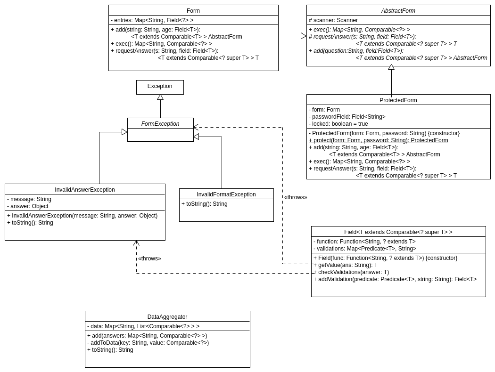

---
title:
- Practice 5. ADSOF.
author:
- Pablo Cuesta and Diego Cid
geometry:
- margin=2.5cm
header-includes: |
    \usepackage[T1]{fontenc}
    \usepackage{mathpazo}
---

# Class diagram



# Part 1: Generic forms for console data input

For this part we have created the class Form and the generic class Field\<T\>.

The Form has a map of questions, which relates a String (a question) with its field. There are two public methods: one to add a new question, and another one to execute the form, which asks the questions to the user.

The Field\<T\> class has a Function (the functional interface Function\<S,T\>), which converts a String to the correct type of the answer (T). It also has the map of validations, whose keys are of type Predicate\<T\>, and the values, of String (the message related to the validation).

The Form uses the field to get the validated value entered by the user, for which it uses the method `T getValue(String ans)` from Field\<T\>, which returns the coverted value, or throws an exception if the value is not valid.

There are two types of exception: when the answer could not be converted, there is an InvalidFormatException; and when the answer is not validated by the field, there is an InvalidAnswerException. These exceptions are used to print in the console the message to the user.

# Part 2: Processing the collected data

For this part, the DataAggregator had to keep a map which had as keys the questions (String), and as values, a list of answers received by the different users.

In order to make this implementation, the data collected by the forms had to be comparable, so we had to change a little bit the requirements from the previous part. For example, now the field is declared as follows:

```java
public class Field<T extends Comparable<? super T>>
```
So, to keep the answers sorted, each time we add new answers to the lists of the map, we have to sort them afterwards.

# Part 3: Protecting the forms by means of a password

For this we had to make the abstract class AbstractForm, with the abstract methods: `add`, `exec` and `requestAnswer` (this one is `protected`, so it is only for our implementation), because these methods can be invoked from both Form and ProtectedForm. The ProtectedForm has a field (the password field) and a form, which is the form that it is protecting.

In the AbstractForm class, we have put a protected attribute: 
```java 
protected Scanner scanner = new Scanner(System.in);
```
This is where we get the input from the user, and this is used in every type of form, so it makes sense to have it in the abstract class.

## Answer to the additional question

All of these standard classes have a method which is: `public static StandardClass valueOf(String s)` (where '`StandardClass`' is the standard class that has to be converted from a String to its type), so we could make use of that, so that the method would not need to be specified.

In order to implement this, we can use reflection to know whether the class has such a method, and, in that case, we use it. In case the class does not have that method, the constructor just throws an exception.